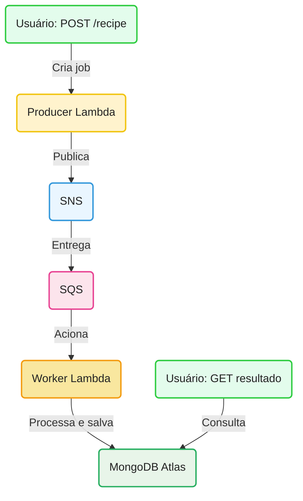

<div align="center">
   <h1>🍳 Recipe Improviser Pipeline</h1>
   <p>Arquitetura serverless para geração e consulta de receitas culinárias usando <b>AWS Lambda</b>, <b>SNS</b>, <b>SQS</b>, <b>API Gateway</b> e <b>MongoDB Atlas</b>.</p>
</div>

---


## 🚀 Como preparar o ambiente


### 1️⃣ Gerando a Lambda Layer do MongoDB
<details>
<summary>Como criar a layer do MongoDB <b>(clique para expandir)</b></summary>

A Lambda Layer permite compartilhar a dependência <code>mongodb</code> entre todas as funções, sem precisar incluir o pacote em cada zip. Siga os passos:


```sh
# 1. Estrutura de pastas
mkdir -p layer-mongodb/nodejs
cd layer-mongodb/nodejs

# 2. Inicialize e instale dependências
npm init -y
npm install mongodb

# 3. Volte e compacte
cd ../..
cd layer-mongodb
zip -r layer-mongodb.zip nodejs
cd ..
```

Depois, faça upload do `.zip` em <b>Lambda &gt; Layers</b> na AWS e adicione a layer nas funções.
</details>

> ⚠️ **Observação:** Não inclua a pasta <code>node_modules</code> do layer no repositório. Apenas mantenha o script de geração e o <code>.zip</code> para deploy.

---


## ☁️ Deploy na AWS Lambda


### 2️⃣ Empacotamento das funções
Para cada função (<code>producer</code>, <code>worker</code>, <code>reader</code>):

```sh
# Exemplo para a função producer
zip -r producer.zip index.mjs shared/
```
Faça upload do zip em <b>Lambda &gt; Funções</b> na AWS.


### 3️⃣ Configuração das Funções Lambda

Adicione as variáveis de ambiente:
- <code>MONGODB_URI</code>: string de conexão do MongoDB Atlas
- <code>TOPIC_ARN</code>: ARN do tópico SNS (producer)
- <code>OPENAI_API_KEY</code>: chave da API OpenAI (worker)


### 4️⃣ Integração com API Gateway

Rotas sugeridas:

| Método | Rota              | Função Lambda |
|--------|-------------------|---------------|
| POST   | /recipe           | producer      |
| GET    | /result/{jobId}   | reader        |
| GET    | /health           | health check  |


### 5️⃣ Integração com SNS e SQS

1. Crie um tópico SNS para os jobs.
2. Crie uma fila SQS (preferencialmente FIFO) e associe ao SNS.
3. Configure a Lambda <code>worker</code> para ser acionada por eventos da SQS.


### 6️⃣ MongoDB Atlas

1. Crie um cluster e a collection <code>jobs</code>.
2. Libere o IP do Lambda na whitelist.
3. Use a string de conexão em <code>MONGODB_URI</code>.

---

## 🔄 Fluxo Resumido




## 🧪 Testes Locais
- Use <code>vitest</code> para rodar os testes automatizados:
   ```sh
   npx vitest run
   ```


## 💡 Observações
- Cada função Lambda é independente e pode ser atualizada individualmente.
- O uso de layer para o MongoDB reduz o tamanho dos pacotes e facilita manutenção.
- O projeto já está pronto para produção serverless e pode ser expandido facilmente.

---


## ⚡ Por que essa arquitetura é otimizada?

- **Funções pequenas e independentes:** Menor cold start, fácil manutenção e escalabilidade.
- **Layer do MongoDB:** Reduz tamanho dos pacotes e acelera deploy.
- **Processamento assíncrono (SNS/SQS):** Producer responde rápido, worker processa pesado.
- **API Gateway desacoplado:** Funções leves, respostas rápidas.
- **MongoDB Atlas gerenciado:** Baixa latência e alta escalabilidade.
- **Escalabilidade automática:** Cada Lambda escala conforme a demanda.


<p align="center"><b>Essas práticas garantem um sistema responsivo, resiliente e com baixo custo operacional, ideal para workloads serverless modernos.</b></p>

---

<div align="center">
   <h3>💬 Ficou com dúvidas, quer trocar ideias ou colaborar?</h3>
   <b>Entre em contato comigo!</b><br><br>
   <a href="mailto:nathaliaccord@gmail.com" target="_blank">
      
   </a>
   <a href="https://www.linkedin.com/in/nath%C3%A1lia-acordi-0a564b223/" target="_blank">
      
   </a>
   <br><br>
   Se curtiu o projeto, dê uma estrela! ⭐
</div>


