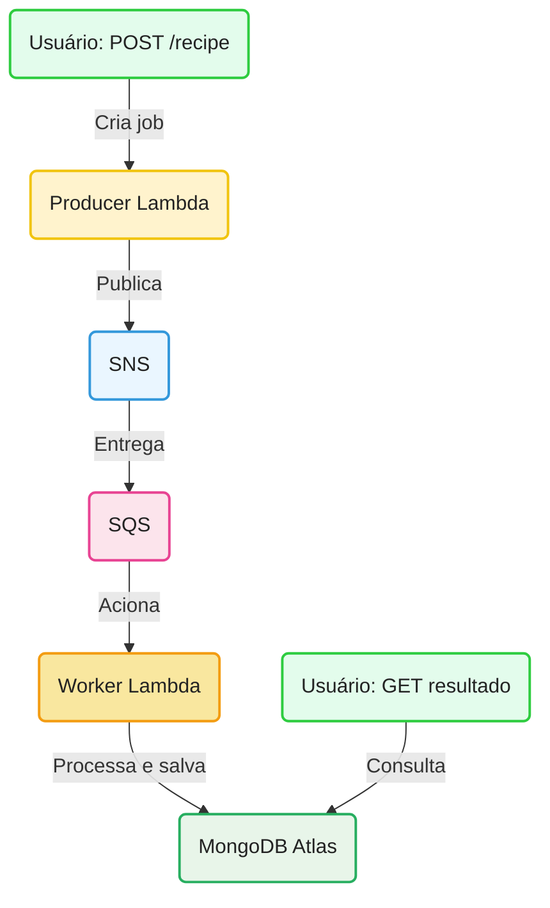

<div align="center">
   <h1>🍳 Recipe Improviser Pipeline</h1>
   <p>Arquitetura serverless assíncrona para geração e consulta de receitas culinárias.</p>

   <p align="center">
  
  
  
  
  
  
  
</p>
</div>

---

## 🔄 Fluxo Resumido




---

## ⚡ Resultado e Impacto das Otimizações

### Lista das melhorias implementadas

- **Sistema de mensageria (SNS/SQS):** Permite desacoplar o recebimento do pedido do processamento pesado, garantindo respostas rápidas ao usuário e maior resiliência.
- **Prompts mais precisos e respostas curtas:** Ajustamos os prompts enviados à OpenAI para serem mais objetivos, limitando o tamanho e a complexidade das respostas. Isso reduziu o risco de respostas truncadas e acelerou o processamento.
- **Aumento da memória do worker para 256 MB:** Com mais memória, a AWS Lambda também oferece mais CPU, reduzindo o tempo de execução da função.


<p align="center"><b>Essas práticas garantem um sistema responsivo, resiliente e com baixo custo operacional, ideal para workloads serverless modernos.</b></p>

---

## Comparativo de Performance e Custos
### 📌 Cenário

Este cenário simula o uso de uma função AWS Lambda por 300 usuários, cada um fazendo 50 requisições por dia durante 30 dias.

**Total de execuções no mês:**  
`300 usuários × 50 req/dia × 30 dias = 450.000 execuções/mês`


### 📊 Tabela Comparativa

| **Cenário**            | **Memória** | **Duração/job** | **Execuções/mês** | **GB-s/mês** | **GB-s pagos** | **Custo (USD)** |
|------------------------|-------------|------------------|-------------------|--------------|----------------|-----------------|
| Antes (128 MB)         | 128 MB      | 12 s             | 450.000           | 675.000      | 275.000        | **$4.58**       |
| Depois (256 MB)        | 256 MB      | 4.8 s            | 450.000           | 540.000      | 140.000        | **$2.33**       |


### 🧮 Cálculos Detalhados

#### **Antes (128 MB × 12 segundos)**

- **Memória em GB:** `128 MB = 0,125 GB`
- **Tempo por execução:** `12 s`
- **Cálculo por execução:** `0,125 GB × 12 s = 1,5 GB-s`
- **Total no mês:** `1,5 GB-s × 450.000 execuções = 675.000 GB-s`
- **Grátis (free tier):** `400.000 GB-s`
- **Excedente:** `675.000 - 400.000 = 275.000 GB-s`
- **Custo:** `275.000 × $0.00001667 = $4.58`

#### **Depois (256 MB × 4.8 segundos)**

- **Memória em GB:** `256 MB = 0,25 GB`
- **Tempo por execução:** `4.8 s`
- **Cálculo por execução:** `0,25 GB × 4.8 s = 1,2 GB-s`
- **Total no mês:** `1,2 GB-s × 450.000 execuções = 540.000 GB-s`
- **Grátis (free tier):** `400.000 GB-s`
- **Excedente:** `540.000 - 400.000 = 140.000 GB-s`
- **Custo:** `140.000 × $0.00001667 = $2.33`


### ℹ️ Observações

- **Execuções**: As 450.000 execuções estão **dentro do limite gratuito (1 milhão)** → custo zero nesse ponto.
- **Cobrança apenas pelo excedente em GB-s**.
- **Preço oficial do AWS Lambda (em us-east-1):**  
  `$0.00001667 por GB-s excedente`  
  [Fonte oficial AWS](https://aws.amazon.com/lambda/pricing/)

---

## 🚀 Como preparar o ambiente

### Lambda Layer do MongoDB
<details>
<summary>Como criar a layer do MongoDB <b>(clique para expandir)</b></summary>

A Lambda Layer permite compartilhar a dependência <code>mongodb</code> entre todas as funções, sem precisar incluir o pacote em cada zip. Siga os passos:

```sh
# 1. Estrutura de pastas
mkdir -p layer-mongodb/nodejs
cd layer-mongodb/nodejs

# 2. Inicialize e instale dependências
npm init -y
npm install mongodb

# 3. Volte e compacte
cd ../..
cd layer-mongodb
zip -r layer-mongodb.zip nodejs
cd ..
```

Depois, faça upload do `.zip` em <b>Lambda &gt; Layers</b> na AWS e adicione a layer nas funções.
</details>

> ⚠️ **Observação:** Não inclua a pasta <code>node_modules</code> do layer no repositório. Apenas mantenha o script de geração e o <code>.zip</code> para deploy.

---

## ☁️ Deploy na AWS Lambda

### Empacotamento das funções
Para cada função (<code>producer</code>, <code>worker</code>, <code>reader</code>):

```sh
# Exemplo para a função producer
zip -r producer.zip index.mjs shared/
```
Faça upload do zip em <b>Lambda &gt; Funções</b> na AWS.

### Configuração das variáveis de ambiente

Adicione as variáveis de ambiente:
- <code>MONGODB_URI</code>: string de conexão do MongoDB Atlas
- <code>TOPIC_ARN</code>: ARN do tópico SNS (producer)
- <code>OPENAI_API_KEY</code>: chave da API OpenAI (worker)

### Integração com API Gateway

Rotas sugeridas:

| Método | Rota              | Função Lambda |
|--------|-------------------|---------------|
| POST   | /recipe           | producer      |
| GET    | /result/{jobId}   | reader        |
| GET    | /health           | health check  |

### Integração com SNS e SQS

1. Crie um tópico SNS para os jobs.
2. Crie uma fila SQS (preferencialmente FIFO) e associe ao SNS.
3. Configure a Lambda <code>worker</code> para ser acionada por eventos da SQS.

### MongoDB Atlas

1. Crie um cluster e a collection <code>jobs</code>.
2. Libere o IP do Lambda na whitelist.
3. Use a string de conexão em <code>MONGODB_URI</code>.

---

## 🧪 Testes Locais
- Use <code>vitest</code> para rodar os testes automatizados:
   ```sh
   npx vitest run
   ```

---

## 💡 Observações
- Cada função Lambda é independente e pode ser atualizada individualmente.
- O uso de layer para o MongoDB reduz o tamanho dos pacotes e facilita manutenção.
- O projeto já está pronto para produção serverless e pode ser expandido facilmente.

---

## 💬 Contato

<div align="center">
   <h3>💬 Ficou com dúvidas, quer trocar ideias ou colaborar?</h3>
   <b>Entre em contato comigo!</b><br><br>
   <a href="mailto:nathaliaccord@gmail.com" target="_blank">
      
   </a>
   <a href="https://www.linkedin.com/in/nath%C3%A1lia-acordi-0a564b223/" target="_blank">
      
   </a>
   <br><br>
   Se curtiu o projeto, dê uma estrela! ⭐
</div>


